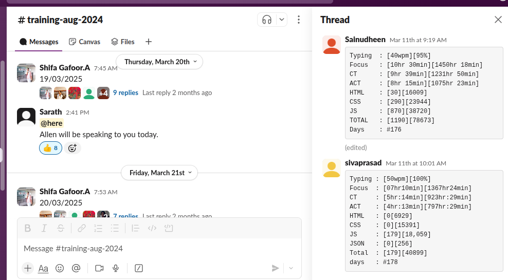

<h1>Track Coder - Automation Project    </h1>

This project automates the process of gathering and recording coding-related statistics, including typing speed (WPM), focus time, active code time, lines of code written, and daily tracking. It scrapes data from various sources like Software.com and MonkeyType using Selenium and Python, then saves the collected data into an Excel sheet for detailed reporting.

## Features

- **Generate Excel Sheet**: Creates an Excel file to log daily statistics for easy tracking and reporting.
- **Take Screenshots**: Captures screenshots of Codetime graph .
- **Fetch Typing Speed (WPM)**: Automatically gathers typing speed (words per minute) from MonkeyType.
- **Fetch Code Time**: Scrapes focus time and code time from the Software.com dashboard.
- **Calculate Lines of Code**: Tracks and logs the number of lines written in HTML, CSS, and JavaScript.
- **Total Coding Days**: Logs consecutive days of activity, helping track daily progress over time.
- **Copy to Clipboard**: Copies the generated values, such as daily metrics or summaries, directly to the clipboard for easy sharing or further processing.

  <table>
    <tr >
      <td></td>
     <td></td>
    </tr>
  </table>

Prerequisites
For Local Setup:

    Python
    Google Chrome
    VSCode Extensions:
                TrackMe  - v3.1.0
                Codetime - v2.8.1

For Docker Setup:

    Docker & Docker Compose

## Installation

### Local Setup

   Clone the repository:

     git clone https://github.com/sainudheenp/track_coder.git
     cd track_coder

Set up the environment: Create a virtual environment and install dependencies:

    python -m venv myenv
    source myenv/bin/activate
    pip install -r requirements.txt

### Docker Setup

   Clone the repository:

     git clone https://github.com/sainudheenp/track_coder.git
     cd track_coder

   Build and run with Docker Compose:

     # Build the Docker image
     docker-compose build
     
     # Run the application
     docker-compose run track_coder
     
     # Run with custom date
     docker-compose run track_coder -date 2025-01-01

   Or build and run manually with Docker:

     # Build the image
     docker build -t track_coder .
     
     # Run the container
     docker run --rm -v $(pwd)/output:/app/output -v $(pwd)/screenshots:/app/screenshots --env-file .env track_coder
     
     # Run with custom date
     docker run --rm -v $(pwd)/output:/app/output -v $(pwd)/screenshots:/app/screenshots --env-file .env track_coder -date 2025-01-01

Configure Environment Variables: Create a .env file in the root directory with the following variables:

    # monkeytype.com
    userEmail_monkey=@gmail.com
    password_monkey=Password

    # app.software.com
    userEmail_code_time=@gmail.com
    password_code_time=password

Running the Project Locally

To run the project locally, execute the following:

     python main.py

for custom date :

     python main.py -date 2025-01-01

### Running with Docker

To run with Docker Compose:

     docker-compose run track_coder

For custom date with Docker:

     docker-compose run track_coder -date 2025-01-01

## Output Paths

### Local Setup

Excel Output Path

The collected data will be saved in an Excel file located at:

    /username/trackcoder/trackcoder.xlsx

Screenshot Output Path:

    /username/trackcoder/screenshots

### Docker Setup

Excel Output Path:
The collected data will be saved in an Excel file located at:

    ./output/trackcoder.xlsx

Screenshot Output Path:

    ./screenshots/

